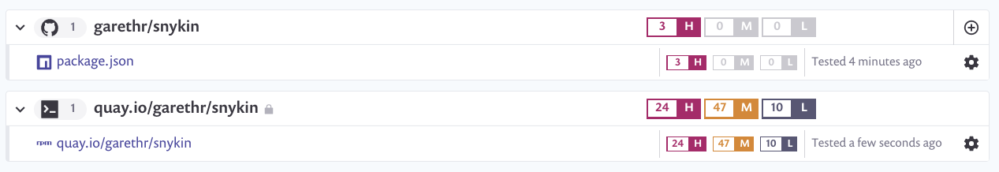

# Snykin

A sample vulnerable Node application for demonstration purposes.

[](https://quay.io/repository/garethr/snykin)


## Local Kubernetes development

This project uses [Tilt](https://tilt.dev/) for a nice local development experience. Simply run:

```console
tilt up
```

The image will be built locally, and deployed using [Helm](https://helm.sh/) to your configured Kubernetes cluster. Any changes, to the application code or Dockerfile, will trigger a rebuild and redeploy.


## Vulnerable?

The application, and the associated image, have a few known vulnerabilities. We can use [Snyk](https://snyk.io) to detect them. In this particular example Snyk is connected directly to the GitHub repository, and we have run `snyk monitor` to check the container image.


